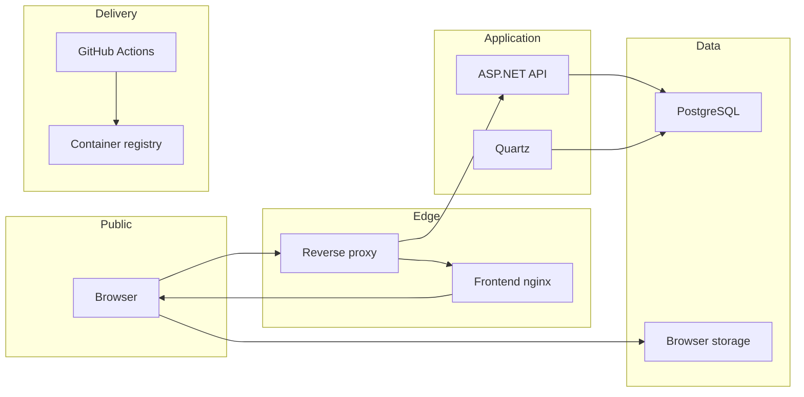

# MelodyTrack threat model

## Executive summary

MelodyTrack is an internet-facing scheduling and CRM application whose highest-value assets are authentication sessions, client and user contact data, appointment and payment integrity, and service availability. The remediation closed the actionable application risks identified by this model: refresh credentials now use HttpOnly cookies with CSRF protection and rotation, portal capabilities can be rotated or revoked and PINs are one-way hashed, proxy ingress is codified and testable, expensive reads have concurrency limits, and container publication is gated and attested. No critical or high-priority threat remains in the reviewed scope. The main residual risks are operational drift from the documented Caddy topology, upstream image/package compromise, and the open question of whether future multi-organization hosting will require tenant isolation.

## Scope and assumptions

- In scope: `MelodyTrack.Web/src`, `MelodyTrack.Web/nginx`, `MelodyTrack.Web/Dockerfile`, `MelodyTrack.Backend/MelodyTrack.Backend`, both dependency manifests, both GitHub Actions configurations, browser storage, PostgreSQL, and the test-container boundary.
- Out of scope: the host operating system, the live deployment state beyond the repository's canonical Caddy compose and smoke check, GitHub and container-registry internals, the managed DNS and Let's Encrypt issuance process, administrator endpoint security, and real iOS Safari hardware behavior.
- Production frontend and API are reachable only through Caddy Docker Proxy and use publicly trusted Let's Encrypt TLS certificates. Direct access to the API container is assumed to be blocked.
- Caddy's default `reverse_proxy` behavior discards untrusted incoming forwarded values and supplies the observed client address to the backend. The backend connection peer is Caddy's Docker-network address rather than loopback or the server's public IP.
- The application is assumed to be a single-organization deployment with trusted staff roles and less-privileged client-portal users. The database contains personal contact details, schedules, notes, course progress, and financial records.
- PostgreSQL and application secrets are assumed to be reachable only by the backend runtime and deployment administrators.

Open questions that would materially change ranking:

- Are multiple independent organizations ever hosted in one database? If so, explicit tenant isolation is required and authorization risks become high priority.

## System model

### Primary components

- React/Vite single-page application served as static files by nginx (`MelodyTrack.Web/Dockerfile`, `MelodyTrack.Web/nginx/nginx.conf`).
- ASP.NET Core 10 API using FastEndpoints, JWT bearer authentication, role checks, rate limiting, Quartz, and structured Problem Details (`MelodyTrack.Backend/MelodyTrack.Backend/Program.cs`).
- PostgreSQL accessed through EF Core and used for domain records, hashed session artifacts, audit logs, and Quartz state (`MelodyTrack.Backend/MelodyTrack.Backend/Data/AppDbContext.cs`).
- Browser memory, cookies, and local storage: the access token remains in memory, the refresh credential is a Secure/HttpOnly/SameSite cookie, a readable cookie supplies the matching CSRF proof, and local storage contains only a non-secret session marker, UI preferences, and account-scoped durable form drafts (`MelodyTrack.Web/src/entities/session/model/authStore.ts`, `MelodyTrack.Web/src/shared/api/http.ts`, `Api/Auth/RefreshSessionCookieService.cs`).
- GitHub Actions and container builds that restore dependencies, test/build the applications, and publish images (`MelodyTrack.Backend/.github/workflows/main.yml`, `MelodyTrack.Web/.github/workflows/main.yml`).

### Data flows and trust boundaries

- Internet user → reverse proxy → frontend nginx: HTML, JavaScript, and static assets over HTTPS; TLS terminates at the proxy, nginx adds CSP, anti-framing, MIME-sniffing, referrer, and permissions headers.
- Browser → reverse proxy → API: credentials, bearer tokens, HttpOnly refresh cookies, CSRF proofs, portal link tokens, PINs, PII, and domain mutations over HTTPS/JSON; FastEndpoints schemas and validators parse input, CORS restricts browser origins, JWT and role policies protect authenticated endpoints, and sensitive anonymous endpoints are rate limited.
- API → PostgreSQL: PII, domain records, hashed authentication tokens, roles, audit data, and Quartz state over the configured PostgreSQL connection; EF Core parameterizes queries and personal contact fields are encrypted with versioned keys.
- API → browser: JSON and Problem Details containing domain data and session artifacts; sensitive responses are marked no-store and production exception details are suppressed.
- Browser → local storage: a non-secret session-presence marker, theme, and account-scoped durable drafts. A one-time compatibility path exchanges and immediately removes refresh tokens created by the previous frontend version.
- GitHub → package registries → CI → container registry: source, NuGet/npm packages, test output, SBOMs, provenance attestations, and container images; lock files, commit-pinned actions, and complete verification gates provide integrity controls, while packages and base images remain upstream dependencies.

#### Diagram

## Assets and security objectives

| Asset | Why it matters | Security objective (C/I/A) |
|---|---|---|
| Passwords, TOTP material, recovery codes, JWT keys, refresh tokens | Compromise enables account takeover or session forgery | C/I |
| Client and user PII | Exposure harms clients and staff and may create regulatory obligations | C/I |
| Appointments, courses, tasks, payments, and balances | Unauthorized changes disrupt operations and financial records | I/A |
| Roles, invites, portal links, and sessions | These define who can enter the system and what they can do | C/I |
| PII encryption keys and database credentials | Compromise defeats protection of the entire datastore | C/I |
| Audit records | Investigation depends on complete, trustworthy event history | I/A |
| API, PostgreSQL, Quartz, and rate-limit capacity | Availability is required for scheduling and client access | A |
| Source, lock files, CI workflows, and images | Supply-chain compromise can affect every deployment | I |

## Attacker model

### Capabilities

- An unauthenticated internet attacker can reach proxy-published frontend and anonymous API routes, submit arbitrary headers and JSON, obtain a portal link that has been disclosed to them, and automate guesses within or across rate-limit windows.
- An authenticated client can inspect and replay their own requests and attempt horizontal or vertical access to staff resources.
- A staff user can store contact and rich-text data that later renders in another staff browser.
- A dependency or CI account compromise can attempt to alter build inputs or published images.

### Non-capabilities

- The model does not assume shell access to the host, write access to the repositories, control of the reverse proxy, possession of deployment secrets, or direct network access to PostgreSQL/API containers.
- It does not assume a browser sandbox escape or compromise of a trusted staff endpoint. Those events would overwhelm several application-level controls and require infrastructure incident response.

## Entry points and attack surfaces

| Surface | How reached | Trust boundary | Notes | Evidence (repo path / symbol) |
|---|---|---|---|---|
| Login, registration, refresh, reset, 2FA, invites | Anonymous HTTPS JSON | Internet → API | Uniform errors, validators, token hashing, and per-route rate limits | `MelodyTrack.Backend/MelodyTrack.Backend/Api/Auth/Endpoints`; `ErrorHandling/ApiRateLimiting.cs` |
| Client portal link and PIN | Capability URL plus anonymous HTTPS JSON | Internet → API | Link identifies a client; PIN establishes a limited session | `MelodyTrack.Backend/MelodyTrack.Backend/Api/ClientPortal/Endpoints` |
| Authenticated FastEndpoints | Bearer-authenticated HTTPS JSON | Browser → API | Active-session preprocessing and role/ownership checks protect mutations | `MelodyTrack.Backend/MelodyTrack.Backend/Program.cs`; `Api/Auth/PreProcessors/ActiveSessionPreProcessor.cs` |
| Contact and rich-text rendering | Stored API data rendered in React | Database → API → browser | Contact handles and BBCode links are normalized before navigation | `MelodyTrack.Web/src/entities/client/lib/contact.ts`; `src/shared/ui/editors/BbcodeContent.tsx` |
| Browser session and draft storage | Same-origin JavaScript | Browser runtime → memory/cookies/local storage | Access token stays in memory; JavaScript cannot read the refresh cookie; mutations supply a cookie-bound CSRF proof | `MelodyTrack.Web/src/entities/session/model/authStore.ts`; `src/shared/api/http.ts`; `Api/Auth/RefreshSessionCookieService.cs` |
| PostgreSQL connection | Backend-only configured connection | API → database | EF parameterization, encrypted PII, hashed opaque tokens | `MelodyTrack.Backend/MelodyTrack.Backend/Data/AppDbContext.cs`; `Utils/UserUtils.cs` |
| Static deployment | Public HTTPS asset requests | Internet → nginx | CSP and hardening headers are applied to all cache-policy locations | `MelodyTrack.Web/nginx/nginx.conf`; `nginx/security-headers.inc` |
| CI and container publication | Push or pull request | GitHub → runners → registry | Restore/build/test gates publication; actions and base images are external inputs | `MelodyTrack.Backend/.github/workflows/main.yml`; `MelodyTrack.Web/.github/workflows/main.yml` |

## Top abuse paths

1. Account takeover: automate password or PIN guesses → try to select new rate-limit buckets with a forged forwarding header → obtain a session → read or mutate sensitive records. The proxy-appended rightmost-address rule now blocks the bucket-selection step.
2. Stored script/navigation abuse: save a crafted social-contact value → wait for staff to open a dashboard, appointment, or compact client history → induce unsafe navigation or script execution. Shared normalization, parallel Telegram/VK regression tests, and CSP break the navigation and execution steps.
3. Session abuse: exploit a future same-origin script injection or malicious dependency → issue same-origin requests while the victim page is active. The attacker cannot read the HttpOnly refresh credential; strict CSP, CSRF proof validation, refresh replay revocation, and session-fan-out auditing narrow and expose this path.
4. Portal abuse: obtain a client capability link → enumerate PINs within repeated windows → establish a client session → expose that client's schedule and course information. Rate limiting, slow PIN hashing, repeated-failure audit events, and explicit link/session revocation constrain recovery time.
5. Authorization bypass: authenticate as a client or ordinary user → alter an identifier in a staff endpoint → exploit a missing role or ownership check → read or corrupt another subject's records.
6. Supply-chain compromise: compromise a package/action/base image → execute during CI or image build → publish a backdoored frontend or API image → steal production data and sessions.

## Threat model table

| Threat ID | Threat source | Prerequisites | Threat action | Impact | Impacted assets | Existing controls (evidence) | Gaps | Recommended mitigations | Detection ideas | Likelihood | Impact severity | Priority |
|---|---|---|---|---|---|---|---|---|---|---|---|---|
| TM-001 | Remote unauthenticated attacker | API is reachable only through the Caddy Docker network | Evade or exhaust authentication rate limits through forwarded-header manipulation | Account takeover or authentication denial of service | Sessions, accounts, availability | The deployment compose file publishes only Caddy, preserves default forwarding behavior, and provides a deployed smoke check proving forged `X-Forwarded-For` values cannot select a bucket (`deploy/compose.caddy.yml`, `deploy/verify-caddy-ingress.sh`) | The smoke check must be run against each deployed topology after proxy/network changes | Operations: run the ingress check after deployment and alert on a failure | Track 429s, unique partition counts, authentication failures, and connection-vs-forwarded anomalies | Low | High | low |
| TM-002 | Authenticated data author or compromised imported record | Crafted contact/rich-text value is displayed to staff | Cause unsafe external navigation or script execution | Staff session theft or phishing | Browser sessions, PII, domain integrity | Strict handle normalization, safe BBCode URL handling, CSP and regression test (`src/entities/client/lib/contact.ts`, `src/shared/ui/editors/BbcodeContent.tsx`, `nginx/security-headers.inc`) | React dependencies and future renderers remain part of the trusted script surface | Frontend owner: keep URL construction centralized and retain CSP checks in canonical verification | Collect CSP violation reports if a reporting endpoint is introduced | Low | High | medium |
| TM-003 | Same-origin script injection or malicious runtime dependency | Attacker executes JavaScript in the frontend origin | Act through the victim browser or attempt to retain a session | Account misuse while the compromised page is active | Refresh tokens, user data | Refresh credential is Secure/HttpOnly/SameSite, cookie use requires a matching CSRF proof, access tokens are memory-only, rotation rejects replays, and fan-out/replay are audited (`RefreshSessionCookieService.cs`, `RefreshEndpoint.cs`, `SessionSecurityMonitor.cs`) | Same-origin script execution can still perform actions available to the current page until it is closed or the session is revoked | Frontend owner: preserve strict CSP and centralized URL/rendering controls; backend owner: retain session anomaly alerts | Alert on refresh replay, unusual active-session fan-out, and unexpected destructive mutations | Low | High | low |
| TM-004 | Authenticated lower-privilege user | A resource endpoint omits a role or ownership constraint | Change identifiers or call staff-only operations | Cross-user disclosure or destructive mutation | PII, schedules, payments, roles | JWT authentication, endpoint role declarations, active-session preprocessing, and authorization integration tests (`Program.cs`, `Api/Auth/PreProcessors/ActiveSessionPreProcessor.cs`, `MelodyTrack.Backend.Tests/AuthorizationTests.cs`) | Authorization remains distributed across endpoints and queries | Backend owner: require a focused authorization regression test for every new resource family and destructive transition | Audit denied and privileged mutations with actor/resource identifiers | Low | High | medium |
| TM-005 | Holder of a disclosed portal link | Capability URL is known and PIN can be guessed | Brute-force PIN or reuse a leaked link | Client schedule/course disclosure | Portal sessions, client data | Link tokens are stored as hashes and can be rotated or revoked; rotation/revocation invalidates portal sessions; PINs use a slow one-way hash; repeated failures are audited; client claims are scoped and endpoints are rate limited (`Api/ClientPortal`, `Api/Clients/Endpoints/*PortalLink*`) | A leaked, unrevoked link and correct PIN remain valid by design | Product/operations: rotate or revoke a link immediately when disclosure is suspected | Alert on repeated PIN failures and unusual portal-session creation | Low | Medium | low |
| TM-006 | Database reader or deployment-secret thief | Database or PII/JWT key is exposed | Decrypt PII or forge/steal sessions | Broad confidentiality and identity compromise | PII, signing keys, sessions | Versioned PII encryption, blind email index, minimum key validation, hashed opaque tokens (`Data/AppDbContext.cs`, `Utils/StartupConfigurationValidator.cs`, `Utils/UserUtils.cs`) | Repository cannot prove secret-store ACLs, backup encryption, or rotation operations | Operations owner: restrict secret and backup access, rehearse key rotation, and separate database from application networks | Secret-access audit logs, backup access alerts, and key-version inventory | Low | High | medium |
| TM-007 | Compromised dependency, action, or base image | Upstream package or build dependency is malicious | Execute during CI/build and publish altered artifacts | Deployment-wide compromise | Source integrity, images, sessions, PII | npm lockfile, NuGet restore graph, Node 26 full verification before publication, commit-pinned actions, least-privilege workflow permissions, and SBOM/provenance generation (`package-lock.json`, both workflow files) | Registry packages and tagged base/runtime images remain upstream trust dependencies | Platform owner: review dependency alerts and periodically resolve/review image digests where operational updates remain maintainable | Registry attestations, dependency alerts, and unexpected image-digest monitoring | Low | High | low |
| TM-008 | Remote authenticated or anonymous attacker | Attacker can call a costly route repeatedly | Send concurrent expensive queries or oversized requests | API/database exhaustion and missed scheduled work | API, PostgreSQL, Quartz | Caddy limits request bodies and upstream timeouts; analytics/exports use a bounded concurrency policy with structured rejection logging; Quartz delay is measured (`deploy/compose.caddy.yml`, `ErrorHandling/ApiRateLimiting.cs`, `Jobs/CreateRecurringAppointments.cs`) | Thresholds require production tuning and observability outside the repository | Operations/backend owners: tune from observed latency and alert on the documented signals | 429s, ASP.NET active requests, DB-pool saturation, Quartz delays, Caddy upstream errors, and per-route concurrency | Low | Medium | low |

## Criticality calibration

- **Critical:** direct unauthenticated compromise of every deployment or irreversible loss of the primary database. Examples: remote code execution in the API container; published image containing an active credential stealer.
- **High:** realistic compromise of many accounts or broad PII/financial integrity with limited prerequisites. Examples: forgeable JWTs; unauthenticated export of all clients; reliable bypass of every authorization check.
- **Medium:** high-impact paths with a strong prerequisite or contained compromise of one account/client. Examples: same-origin script execution acting through a live privileged page; portal credential guessing for a disclosed link; authorization omission on one resource family.
- **Low:** limited disclosure or operational inconvenience with easy recovery. Examples: non-sensitive route metadata exposure; isolated UI denial of service; disclosure of public service labels.

## Focus paths for security review

| Path | Why it matters | Related Threat IDs |
|---|---|---|
| `MelodyTrack.Backend/MelodyTrack.Backend/Program.cs` | Defines middleware order, CORS, authentication, errors, migrations, and deployment behavior | TM-001, TM-004, TM-008 |
| `MelodyTrack.Backend/MelodyTrack.Backend/ErrorHandling/ApiRateLimiting.cs` | Establishes anonymous authentication-abuse partitions | TM-001, TM-005 |
| `MelodyTrack.Backend/MelodyTrack.Backend/Api/Auth` | Creates, rotates, revokes, and recovers privileged sessions | TM-001, TM-003, TM-004 |
| `MelodyTrack.Backend/MelodyTrack.Backend/Api/ClientPortal` | Implements capability-link and PIN authentication plus client-scoped reads | TM-001, TM-004, TM-005 |
| `MelodyTrack.Backend/MelodyTrack.Backend/Data/AppDbContext.cs` | Maps encrypted PII and authorization-critical relationships | TM-004, TM-006 |
| `MelodyTrack.Backend/MelodyTrack.Backend/Utils/UserUtils.cs` | Implements password, opaque-token, logging-reference, and JWT helpers | TM-003, TM-006 |
| `MelodyTrack.Web/src/entities/session/model` | Controls in-memory and persistent browser session state | TM-002, TM-003 |
| `MelodyTrack.Web/src/entities/client/lib/contact.ts` | Normalizes externally navigable stored contact values | TM-002 |
| `MelodyTrack.Web/src/shared/ui/editors/BbcodeContent.tsx` | Parses and renders user-authored rich text and links | TM-002 |
| `MelodyTrack.Web/nginx` | Defines production browser-side security and cache headers | TM-002, TM-003 |
| `deploy/compose.caddy.yml`; `deploy/verify-caddy-ingress.sh` | Defines and verifies the only supported API ingress boundary | TM-001, TM-008 |
| `MelodyTrack.Backend/.github/workflows` | Restores, validates, and publishes backend artifacts | TM-007 |
| `MelodyTrack.Web/.github/workflows` | Restores and publishes frontend artifacts | TM-007 |

## Residual risk register

| Severity | Evidence | Decision and owner | Follow-up condition |
|---|---|---|---|
| Low | The repository cannot force production to use `deploy/compose.caddy.yml` or run its smoke check | Operations owner must keep Caddy as the only published ingress and run `deploy/verify-caddy-ingress.sh` after deployment | Revalidate whenever Docker networks, published ports, upstream proxy chains, or Caddy labels change |
| Low | Packages and tagged runtime/base images remain external build inputs | Platform owner accepts normal upstream dependency trust with pinned actions, lock files, audits, and image attestations | Review dependency alerts and unexpected published-image digest changes |
| Open | A future multi-organization deployment would change the current single-organization authorization model | Product/backend owner must decide tenancy before sharing one database between independent organizations | Introduce explicit tenant keys and isolation tests before enabling multi-organization hosting |

## Quality check

- Covered discovered anonymous, authenticated, browser-rendering, storage, database, CI, and container entry points.
- Connected every modeled trust boundary to at least one threat.
- Kept runtime threats separate from CI/development and Testcontainers concerns.
- Incorporated the confirmed reverse-proxy-only TLS deployment and explicit test authorization.
- Incorporated the confirmed Caddy Docker Proxy topology and retained multi-organization hosting as the remaining material open question.
